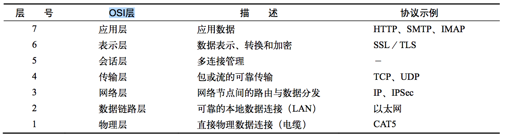
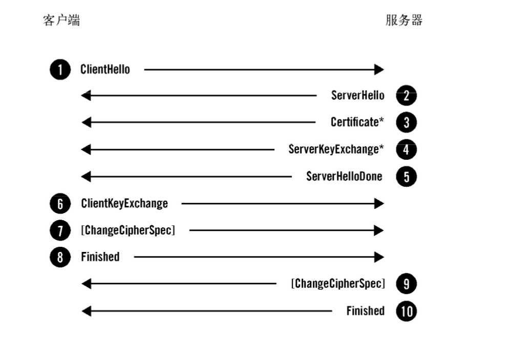
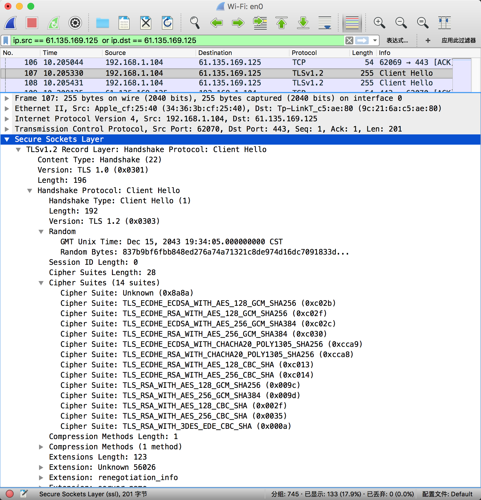
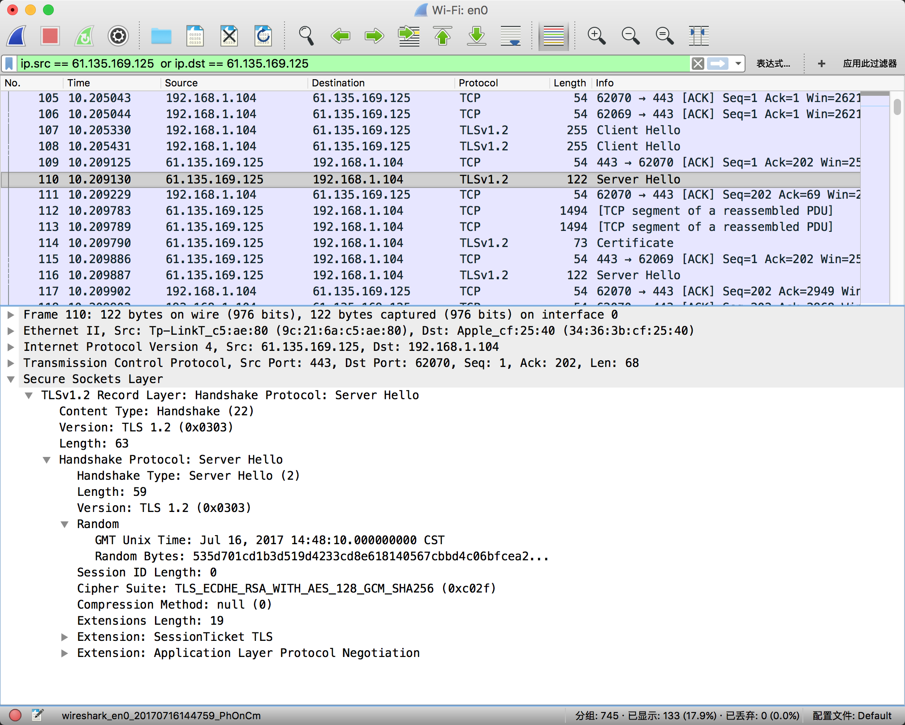
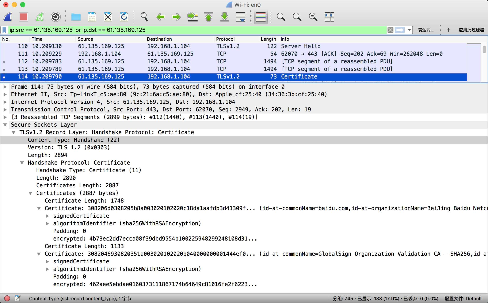
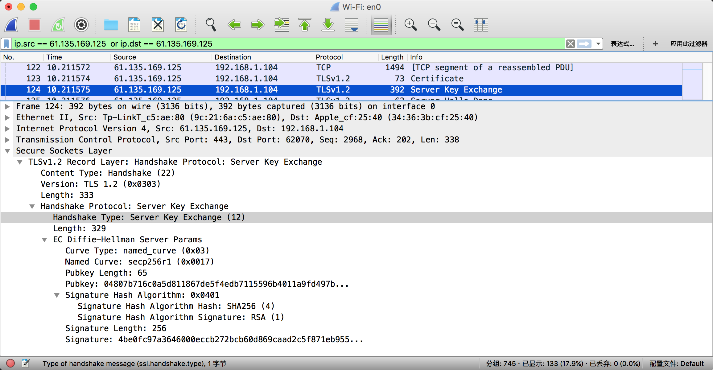
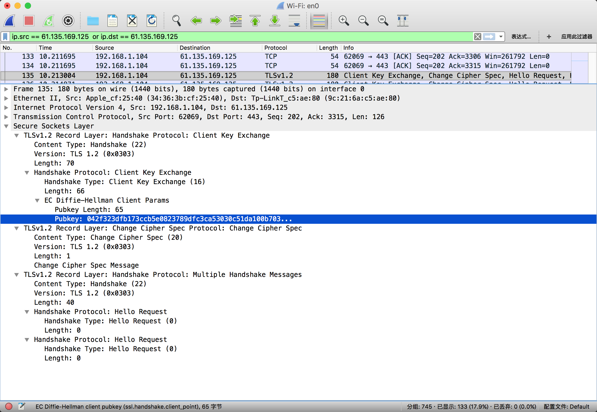
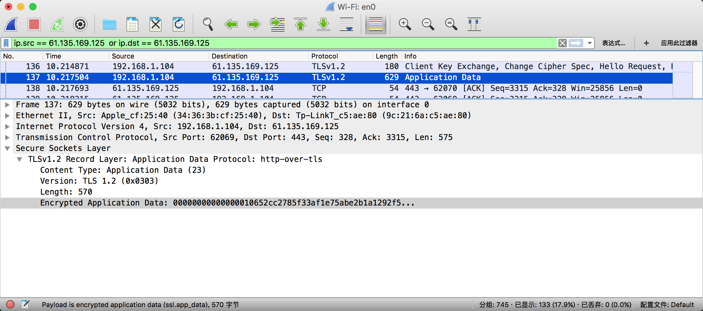

HTTPS（全称：Hyper Text Transfer Protocol over Secure Socket Layer），是以安全为目标的 HTTP 通道，简单讲是 HTTP 的安全版。HTTPS 就是将 HTTP 协议数据包放到 SSL/TSL 层加密后，在 TCP/IP 层组成 IP 数据报去传输，以此保证传输数据的安全。SSL/TLS 处于 TCP 协议之上，HTTP(或者其它 TCP 协议，如 SMTP、IMAP) 协议之下，在 《HTTPS 权威指南》一书中将它归为表示层。

> 网景(NetScape)公司在 1994 年开发了 SSL 协议(Secure Sockets Layer) 1.0 版，但是直到 1996 年 SSL3.0 版本问世，才得到大规模应用。TLS(Transport Layer Security) 是 SSL 的升级版，目前主流浏览器都已经实现了 TLS1.2 的支持。

##2. TLS 握手

SSL/TLS 协议的基本思路是：

1. 客户端向服务器索要并验证公钥
2. 双方协商生成“对话秘钥”
3. 双方采用“对话秘钥”进行加密通信

生成“对话秘钥”的过程就是“握手”，握手是TLS协议中最精密复杂的部分。在这个过程中，通信双方协商连接参数，并且完成身份验证。一次完整的握手通常包含如下流程：

下面结合 WireShark 抓包分析上图中每一步传递的信息。WireShark 的使用方法在此不做介绍，如果不了解，可以通过 [一站式学习 Wireshark](https://community.emc.com/thread/194901)学习它的基本用法。抓包步骤：

1. 打开 Wireshark
2. 在浏览器中打开 [百度](https://www.baidu.com)，拿到 ip 地址，我是通过 chrome 的一个[插件](https://chrome.google.com/webstore/detail/%E7%BD%91%E7%AB%99-ip-%E4%BF%A1%E6%81%AF%E6%9F%A5%E8%AF%A2/mifjlfhembandabikpiehhokhdepbdai?hl=zh-CN)取得 ip 地址的。
3. 在 Wireshark 中过滤出百度的数据包。

###2.1 Client Hello

这条消息将客户端的功能和首选项传送给服务器。

1. version: 协议版本。
2. Random: 随机数，在握手时，客户端和服务器都会提供随机数。这种随机性对每次握手都是独一无二的，在 身份验证中起着举足轻重的作用。它可以防止重放攻击，并确认初始数据交换的完整性。
3. Session: 第一次连接时，session ID 是空的，表示客户端不希望恢复某个已存在的会话，在后面的连接中，服务器可以借助会话 ID 在自己的缓存在找到对应的会话状态。
4. Cipher Suites: 密码套件，此列表中包含了客户端支持所有密码套件，我的浏览器支持 14 个。
5. Compression Methods: 压缩方法
6. Extensions: 扩展会携带额外数据

###2.2 Sever Hello

Server Hello消息的意义是将服务器选择的连接参数传送回客户端。消息的结构与 Client Hello 相似，只是每个字段只包含一个选项。

###2.3 Certificate

Certificate 消息用于携带服务器 X.509 证书链，图中有两个证书，第一个是域名为：baidu.com 的证书，第二个是 CA 证书，用于验证第一个证书的正确性。那如何验证第二个 CA 证书是否被篡改过呢？那就要使用浏览器内置的根证书去验证它了。

###2.4 Server Key Exchange

ServerKeyExchange消息的目的是携带密钥交换的额外数据。消息内容对于不同的协商算法套件都会存在差异。这里传回了 [Diffie-Hellman](https://zh.wikipedia.org/wiki/%E8%BF%AA%E8%8F%B2-%E8%B5%AB%E7%88%BE%E6%9B%BC%E5%AF%86%E9%91%B0%E4%BA%A4%E6%8F%9B) 密钥交换算法的参数，如果是使用 RSA 加密算，这一步服务器会传一个随机数给客户端。

###2.5 Server Hello Done
ServerHelloDone消息表明服务器已经将所有预计的握手消息发送完毕。在此之后，服务器会 等待客户端发送消息。

###2.6 Client Key Exchange

ClientKeyExchange消息携带客户端为密钥交换提供的所有信息。这里向服务器传送了 Diffie-Hellman 算法的另一个参数。如果使用了 RSA 加密算法，客户端会使用服务器的公钥加密一个随机数传给服务器，服务器收到后使用私钥解密。

###2.7 Change Cipher Spec
ChangeCipherSpec 消息表明发送端已取得用以生成连接参数的足够信息，已经生成加密秘钥，并且将切换到加密模式。客户端和服务器在条件成熟时都会发送这个消息。这条消息有时会与 Client Key Exchange 消息一起发出，如上图所示。

###2.8 Finished
Finished 消息意味着握手已经完成。消息内容将加密，以便双方可以安全地交换验证整个握 手完整性所需的数据。

##3. 数字证书

##4. iOS 上配置