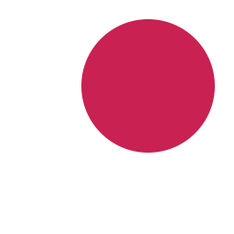

###Blend Modes 
在 Core Graphics 中，我们通过设置 Blend Mode 混合两张图片，或者把图片混合到当前 context 的背景中。通常的使用步骤如下:

1. 绘制背景
2. 设置 [CGContextSetBlendMode](https://developer.apple.com/documentation/coregraphics/1455994-cgcontextsetblendmode)
3. 绘制图片到背景上

有两张图片

<div align=center>

</div>

<!--
-->
使用 `kCGBlendModeMultiply` 混合后的结果是这样的：

<div align=center>

</div>

<!--
-->
`CGBlendMode` 定义了很多种混合模式供我们使用，其中第一部分的混合效果在 [Using Blend Modes with Images](https://developer.apple.com/library/archive/documentation/GraphicsImaging/Conceptual/drawingwithquartz2d/dq_images/dq_images.html#//apple_ref/doc/uid/TP30001066-CH212-CJBIJEFG) 可以查看。下一节一起来了解下 第二部分的混合模式（Porter-Duff）。

```objc
typedef CF_ENUM (int32_t, CGBlendMode) {
    /* Available in Mac OS X 10.4 & later. */
    kCGBlendModeNormal,
    kCGBlendModeMultiply,
    kCGBlendModeScreen,
    kCGBlendModeOverlay,
    kCGBlendModeDarken,
    kCGBlendModeLighten,
    kCGBlendModeColorDodge,
    kCGBlendModeColorBurn,
    kCGBlendModeSoftLight,
    kCGBlendModeHardLight,
    kCGBlendModeDifference,
    kCGBlendModeExclusion,
    kCGBlendModeHue,
    kCGBlendModeSaturation,
    kCGBlendModeColor,
    kCGBlendModeLuminosity,

    /* Available in Mac OS X 10.5 & later. R, S, and D are, respectively,
       premultiplied result, source, and destination colors with alpha; Ra,
       Sa, and Da are the alpha components of these colors.

       The Porter-Duff "source over" mode is called `kCGBlendModeNormal':
         R = S + D*(1 - Sa)

       Note that the Porter-Duff "XOR" mode is only titularly related to the
       classical bitmap XOR operation (which is unsupported by
       CoreGraphics). */

    kCGBlendModeClear,                  /* R = 0 */
    kCGBlendModeCopy,                   /* R = S */
    kCGBlendModeSourceIn,               /* R = S*Da */
    kCGBlendModeSourceOut,              /* R = S*(1 - Da) */
    kCGBlendModeSourceAtop,             /* R = S*Da + D*(1 - Sa) */
    kCGBlendModeDestinationOver,        /* R = S*(1 - Da) + D */
    kCGBlendModeDestinationIn,          /* R = D*Sa */
    kCGBlendModeDestinationOut,         /* R = D*(1 - Sa) */
    kCGBlendModeDestinationAtop,        /* R = S*(1 - Da) + D*Sa */
    kCGBlendModeXOR,                    /* R = S*(1 - Da) + D*(1 - Sa) */
    kCGBlendModePlusDarker,             /* R = MAX(0, (1 - D) + (1 - S)) */
    kCGBlendModePlusLighter             /* R = MIN(1, S + D) */
};
```

###Porter-Duff
Porter-Duff 这个名词是为了表达对 Thomas Porter 和 Tom Duff 的敬意，他们于 1984 年发表了一篇名为 “[Compositing Digital Images](https://dl.acm.org/citation.cfm?id=808606)”的开创性论文。在这篇文章中，两位作者描述了12种合成操作符，具体来说就是当我们把原图像绘制到目标图像处时应该如何计算二者结合后的颜色。由于 Porter 和 Duff 的工作只关注原图像和目标图像共同绘制对 alpha 通道（即我们所理解的透明度）的影响，所以我们又把在他们论文所提到的 12 种操作称为 alpha 合成模式。下面看一下这 12 中合成模式的结果：

有两张图片

<div align=center>
	
</div>

<!--
-->

使用下面的代码测试混合后的效果：

```objc
- (UIImage *)blendImageWithSize:(CGSize)size
{
    UIGraphicsBeginImageContext(size);
    
    UIImage *destinationImg = [UIImage imageNamed:@"destination.png"];
    [destinationImg drawInRect:CGRectMake(0, 0, size.width, size.height) blendMode:kCGBlendModeNormal alpha:1.f];
    UIImage *sourceImg = [UIImage imageNamed:@"source.png"];
    [sourceImg drawInRect:CGRectMake(0, 0, size.width, size.height) blendMode:kCGBlendModeCopy alpha:1.f];
    UIImage *newImage = UIGraphicsGetImageFromCurrentImageContext();
    
    UIGraphicsEndImageContext();
    
    return newImage;
}
```

<div align=center>
	
</div>

<!--
-->
Demo 在[这里](https://github.com/daxiazhou/Demos/tree/master/BlendModesDemo)，可以手动运行起来试试各种混合模式的效果。

###实现镂空文字效果
了解了各种混合模式的效果，实现镂空文字效果就不难了。自定义一个 Label，重写 `drawRect:` 方法，组合运用混合模式就可以实现。

```objc
- (void)drawRect:(CGRect)rect {
    [super drawRect:rect];
    CGContextRef context = UIGraphicsGetCurrentContext();
    // 绘制圆角
    if (self.cornerRadius) {
        UIBezierPath *path = [UIBezierPath bezierPathWithRoundedRect:rect cornerRadius:self.cornerRadius];
        [path addClip];
        CGContextAddPath(context, path.CGPath);
    }
    
    CGContextSaveGState(context);
    // 文字以外区域颜色
    if (self.fillColor) {
        [self.fillColor setFill];
        UIRectFill(rect);
    }
    
    // 借助 UILabel 绘制文字
    CGContextSetBlendMode(context, kCGBlendModeDestinationOut);
    UILabel *label = [[UILabel alloc] initWithFrame:rect];
    label.font = self.font;
    label.text = self.text;
    label.textAlignment = self.textAlignment;
    label.backgroundColor = [UIColor clearColor];
    [label.layer drawInContext:context];
    CGContextRestoreGState(context);
    
    // 还可以在镂空文字价格半透明蒙层
//    UIColor *textColor = [[UIColor blackColor] colorWithAlphaComponent:0.2];
//    [textColor setFill];
//    UIRectFillUsingBlendMode(rect, kCGBlendModeDestinationOver);

}
```
成果展示

<div align=center>
	
</div>

<!--
-->
###参考文章

* [谈谈对drawRect的理解](https://123sunxiaolin.github.io/2017/03/26/[UIVIew]%E8%B0%88%E8%B0%88%E5%AF%B9drawRect%E7%9A%84%E7%90%86%E8%A7%A3/)
* [Alpha compositing](https://en.wikipedia.org/wiki/Alpha_compositing)
* [iOS中使用blend改变图片颜色
](https://onevcat.com/2013/04/using-blending-in-ios/)
