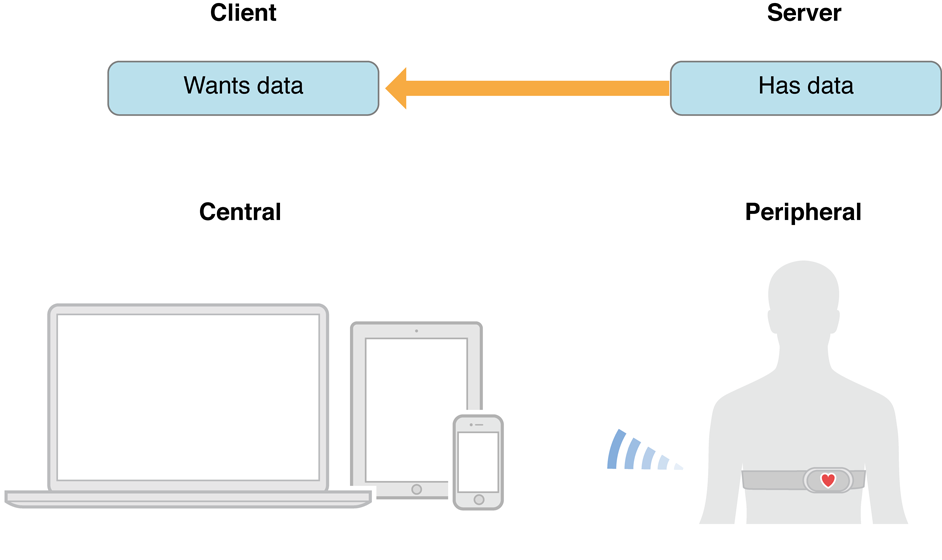
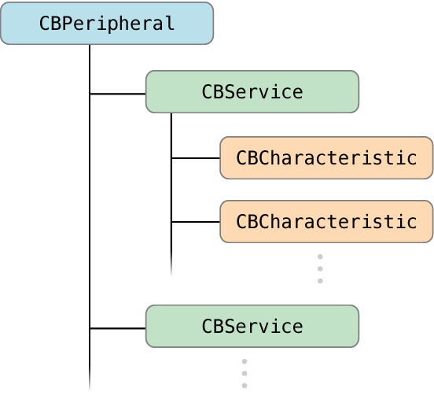
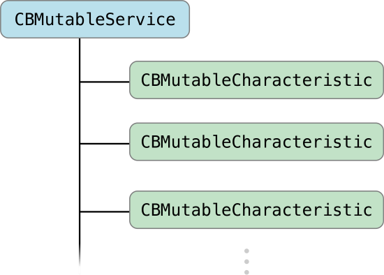
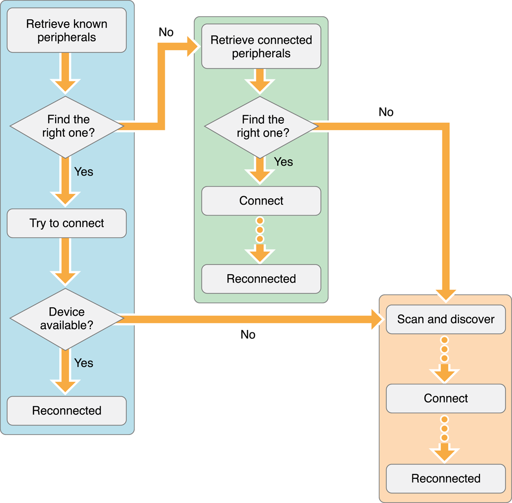

##1、Core Bluetooth 概述
Core Bluetooth framework 提供了 App 与蓝牙设备通信相关的类，使用这个框架，App 可以发现、探测附近的蓝牙外围设备，比如心率监视器、数字恒温器或者其它 iOS 设备。低功率蓝牙无线技术基于蓝牙 4.0 协议，这个协议中定义了一系列通信协议。Core Bluetooth framework 是这些通信协议栈的一个抽象表示，它为开发者隐藏了许多底层细节，方便开发者开发与蓝牙设备交互的 App。


###中心设备和外围设备是蓝牙通信中的两个关键参与者
在蓝牙通信过程中，有两个关键参与者，中心设备和外围设备。通常，外围设备提供其它设备需要的数据，中心设备使用外围设备提供的信息完成某些任务。例如，具备蓝牙功能的心率监视器为一个 iOS App 提供房间心率数据，App 使用友好的方式展示用户心率。



外围设备将它的数据以 advertising packet 的形式向外广播，advertising packet 是一个比较小的数据包，包含外围设备名称和主要功能等重要信息。中心设备可以扫描任何它感兴趣的外围设备广播信息。


###外围设备的数据结构
连接外围设备的目的是为了与它进行数据交互，在做之前，有必要了解外围设备的数据结构。

外围设备可能包含一个或者多个服务，服务是一个数据集合，它与外围设备的功能或者特性相关联。例如，心率监视器的一个服务显示心率传感器的数据。

服务由特征或者内部的服务（其它服务的引用）组成，特征提供外围设备服务的深层细节。例如，心率服务包含一个描述心率传感器位置的特征 和一个传输心率值的 特征。


###中心设备与外围设备的数据交互
当中心设备与外围设备建立连接后，它可以发现外围设备提供的所有服务和特征。中心设备可以读写外围设备的特征，比如，App 向数字恒温器请求室内温度，或者提供一个值设置室内温度。

当手机作为中心设时，使用 CBCentralManager 对象表示本地中心设备，它用于管理发现和连接的外围设备。CBPeripheral 对象表示外围设备，外围设备包含多个 CBService 对象和 CBCharacteristic 对象。



当手机作为外围设备时，使用 CBPeripheralManager 表示本地外围设备对象。CBPeripheralManager 用于管理本地外围设备发布的服务（使用 CBMutableService 对象表示）和特征（使用 CBMutableCharacteristic 对象表示），并且负责向远程中心设备广播它的服务。CBPeripheralManager 还要响应远程中心设备的读写请求。




在绝大多数使用蓝牙的场景中，都是将手机作为中心设备，这里也主要介绍中心设备的相关的开发知识。

##2、手机作为中心设备
在蓝牙通讯过程中，当手机作为中心设备时，需要执行下列任务：

1. 建立一个 Central Manager 实例进行蓝牙管理
2. 搜索外围设备
3. 连接外围设备
4. 获得外围设备的服务
5. 获得服务的特征
6. 从外围设备读数据
7. 给外围设备发送数据

下面详细介绍每个步骤的工作。

###1. 启动一个 Central Manager
CBCentralManager 是 Core Bluetooth 中表示本地中心设备的对象，在进行任何蓝牙事务之前，你必须先初始化一个 CBCentralManager 对象。

```objc
myCentralManager =
        [[CBCentralManager alloc] initWithDelegate:self queue:nil options:nil];
```
在上面的代码中，把 Self 设置为 CBCentralManager 的代理，self 需要实现 CBCentralManagerDelegate 协议，通过该协议的方法接收 Central Manager 的各种事件。这里将队列设置为 nil，Central Manager 会把各种事件分发到主队列上。

###2. 搜索外围设备
Central Manager 实例被创建后，要做的第一件事就是发现外围设备。前面介绍过，外围设备会广播消息，我们通过调用 central manager 的 `scanForPeripheralsWithServices:options:` 方法可以发现附近对外发送广播消息的外围设备。

```objc
    [myCentralManager scanForPeripheralsWithServices:nil options:nil];
```
**注意**，如果向第一个参数传 nil，central manager 会忽略外围设备支持的服务，返回发现的全部外围设备。在实际使用的时候，通常会传一组 [CBUUID](https://developer.apple.com/documentation/corebluetooth/cbuuid) 对象（每个 CBUUID 代表外围设备对外广播的一个服务），central manager 只返回广播这些服务的外围设备，过滤了那些你不感兴趣的外围设备。

每次 central manager 发现外围设备的时候，它会调用代理对象的 `centralManager:didDiscoverPeripheral:advertisementData:RSSI:` 方法。新发现的外围设备作为一个 ` CBPeripheral` 对象被返回，如果想连接这个外围设备，就要强引用它，防止被系统释放。

```objc
- (void)centralManager:(CBCentralManager *)central
 didDiscoverPeripheral:(CBPeripheral *)peripheral
     advertisementData:(NSDictionary *)advertisementData
                  RSSI:(NSNumber *)RSSI {
 
    NSLog(@"Discovered %@", peripheral.name);
    self.discoveredPeripheral = peripheral;
    ...
```
如果你想连接多个外围设备，可以把发现的外围设备存在数组中。无论任何情况，只要发现了所有你想连接的外围设备，就停止扫描，以便节省电量。

```objc
[myCentralManager stopScan];
```
###3. 连接外围设备

发现你感兴趣的外围设备后，使用 `connectPeripheral:options:` 方法向外围设备发起连接请求。

```objc
    [myCentralManager connectPeripheral:peripheral options:nil];
```

如果连接成功了，central manager 会调用代理对象的 `centralManager:didConnectPeripheral:` 方法。在与外围设备进行进一步交互之前，要为外围设备设置一个代理对象(<CBPeripheralDelegate>)，使用代理对象接收外围设备的各种回调。

```objc
- (void)centralManager:(CBCentralManager *)central
  didConnectPeripheral:(CBPeripheral *)peripheral {
 
    NSLog(@"Peripheral connected");
    peripheral.delegate = self;
    ...
```

###4. 获得外围设备的服务
与外围设备建立连接后，你可以探测它的数据。第一步，探测它提供的服务。因为受限于 size 大小，外围设备的广播消息中只包含部分它提供的部分服务，探测时，你可能会发现更多的服务。使用 CBPeripheral 的 `discoverServices:` 方法探测它的服务：

```objc
    [peripheral discoverServices:nil];
```
**注意**，实际使用时，一般不会传 nil，因为它会返回外围设备提供的所有服务。外围设备可能提供多个服务，有些并不是我们感兴趣的，发现这些不需要的服务也会消耗电池电量。所以，为了节省电量，这里通常会传一组感兴趣的服务（一组服务的 UUID）。

当发现指定的服务的时候，CBPeripheral 会调用代理对象的 `peripheral:didDiscoverServices:` 方法。

```objc
- (void)peripheral:(CBPeripheral *)peripheral
didDiscoverServices:(NSError *)error {
 
    for (CBService *service in peripheral.services) {
        NSLog(@"Discovered service %@", service);
        ...
    }
    ...
```
###5. 获得服务的特征
发现感兴趣的服务之后，下一步是探测服务的特征。调用 CBPeripheral 的 `discoverCharacteristics:forService:` 方法：

```objc
    NSLog(@"Discovering characteristics for service %@", interestingService);
    [peripheral discoverCharacteristics:nil forService:interestingService];
```
**注意**，与探测服务的方法类似，实际使用中第一个参数不传 nil，传感兴趣的特征的 UUID，以便节省电量。

发现指定特征后，CBPeripheral 调用代理对象的 `peripheral:didDiscoverCharacteristicsForService:error:` 的方法返回特征：

```objc
- (void)peripheral:(CBPeripheral *)peripheral
didDiscoverCharacteristicsForService:(CBService *)service
             error:(NSError *)error {
 
    for (CBCharacteristic *characteristic in service.characteristics) {
        NSLog(@"Discovered characteristic %@", characteristic);
        ...
    }
    ...
```

###6. 从外围设备读数据
一个特征包含服务信息的一个值，比如，健康温度计服务的一个温度测量特征有一个表示温度的值。在发现指定特征后，使用 CBPeripheral 的 `readValueForCharacteristic:` 方法读取特征的值：

```objc
    NSLog(@"Reading value for characteristic %@", interestingCharacteristic);
    [peripheral readValueForCharacteristic:interestingCharacteristic];
```

读取的结果通过 CBPeripheral 代理对象的 `peripheral:didUpdateValueForCharacteristic:error:` 方法返回。

```objc
- (void)peripheral:(CBPeripheral *)peripheral
didUpdateValueForCharacteristic:(CBCharacteristic *)characteristic
             error:(NSError *)error {
 
    NSData *data = characteristic.value;
    // parse the data as needed
    ...
```

**注意**，并不是所有的特征都是可读的，可以检查特征的 properties 属性，如果值为 CBCharacteristicPropertyRead，就是可读的。如果不可读，`peripheral:didUpdateValueForCharacteristic:error:` 会返回错误。

**订阅一个特征值**

使用 `readValueForCharacteristic:` 方法读取静态之很方便，但是不适合读取动态值，我们可以使用订阅的方式读取动态变化的值，当订阅的值改变时，我们会收到外围设备的一个通知。调用 CBPeripheral 的 `setNotifyValue:forCharacteristic:` 方法设置订阅：

```objc
    [peripheral setNotifyValue:YES forCharacteristic:interestingCharacteristic];
```	

如果订阅了外围设备一个特征，CBPeripheral 会调用它的代理方法 `peripheral:didUpdateNotificationStateForCharacteristic:error:` 返回是否订阅成功，如果订阅失败，可以从 error 对象中得到原因：

```objc
- (void)peripheral:(CBPeripheral *)peripheral
didUpdateNotificationStateForCharacteristic:(CBCharacteristic *)characteristic
             error:(NSError *)error {
 
    if (error) {
        NSLog(@"Error changing notification state: %@",
           [error localizedDescription]);
    }
    ...
```

**注意**，并不是所有的特殊都支持订阅，在订阅之前可以对特征的 properties 属性做判断，如果值为是 CBCharacteristicPropertyNotify 或者 CBCharacteristicPropertyIndicate，就是支持的。

订阅成功后，特征值的变化时，外围设备会调用代理对象的 `peripheral:didUpdateValueForCharacteristic:error: ` 方法返回变化的值。

###7. 给外围设备发送数据

有时候需要给外围设备发送数据，比如设置数字恒温器的温度。如果特征的值是可写的，我们可以调用 CBPeripheral 的 `writeValue:forCharacteristic:type:`，例如：

```objc
    NSLog(@"Writing value for characteristic %@", interestingCharacteristic);
    [peripheral writeValue:dataToWrite forCharacteristic:interestingCharacteristic
        type:CBCharacteristicWriteWithResponse];
```

这个方法中第二个参数表示写入数据后是否需要回调结果，这里传了 CBCharacteristicWriteWithResponse，表示外围设备要告诉 App 是否写入成功，外围设备会调用代理对象的 `peripheral:didWriteValueForCharacteristic:error:` 方法，返回写入的结果。

```objc
- (void)peripheral:(CBPeripheral *)peripheral
didWriteValueForCharacteristic:(CBCharacteristic *)characteristic
             error:(NSError *)error {
 
    if (error) {
        NSLog(@"Error writing characteristic value: %@",
            [error localizedDescription]);
    }
    ...
```

如果传了 CBCharacteristicWriteWithoutResponse，我们既不能保证数据正确写入，也无法获得回调。


##3、Core Bluetooth 后台处理
对于 iOS App，运行在前台与运行在后台有很大的差别，运行在后台时只能获得非常有限的系统资源。App 退到后台或者被挂起时， 一般蓝牙任务是无法运行。如果需要 App 在后台处理蓝牙相关的任务， 我们可以把 App 设置为支持 Core Bluetooth 后台运行模式，系统会把 App 从挂起状态唤醒，去处理蓝牙相关的任务。只要在 info.plist 中添加 UIBackgroundModes，有两种后台运行模式，对应的值分别是:

* bluetooth-central:作为蓝牙中心设备
* bluetooth-peripheral: 作为蓝牙外围设备

###中心设备后台运行模式
将 App 设置为蓝牙后台中心设备后，当 App 运行在后台时，仍然可以发现和连接外围设备，也可以与外围设备交换数据。另外，当任何 `CBCentralManagerDelegate` 和 `CBPeripheralDelegate` 代理方法被触发时，允许 App 处理重要的事件，比如一建立或者断开个连接、外围设备特征值变化。虽然 App 在后台可以处理蓝牙任务，但是在后台扫描外围设备的行为与 App 在前台时有很大差异。比如：

* CBCentralManagerScanOptionAllowDuplicatesKey 被忽略，一个外围设备的多条广播信息被合并为一个事件。
* 如果后台所有的 App 都在扫描，你的 App 扫描到广播信息的间隔将会增加，也就是说，会花费更多的时间去发现外围设备。

在后台运行蓝牙任务也是会耗电的，所以被唤醒的 App 要尽可能快的执行完任务。声明为后台蓝牙运行模式的 App 必须遵循下面的建议：

* App 应该提供一个会话界面，允许用户决定何时开始和结束发送蓝牙事件。
* 一旦被唤醒， App 有 10s 时间去完成任务。最好能够尽快完成任务，好让系统再次将它挂起。如果在后台执行长时间任务，有可能会被系统杀死。
* App 被系统唤醒时不要做其它不相关的任务。

###在后台执行长期活动

有的 App 需要在后台使用蓝牙做一些长期活动，例如，家庭安全 App 与智能门锁之间的通信。当 App 在后台时，智能门锁与 App 交互，当用户离开家时自动锁门，回到家时自动开门。当用户离开家，因为 iOS 设备与门锁的距离超出范围，断开了连接。这个时候，App 调用 CBCentralManager 类的 `connectPeripheral:options:` 方法，因为连接请求没有超时，当用户回到家时 iOS 设备会重新连接上智能门锁。

现在想象下这种情况，当然用户离开家几天，App 被系统杀死了，当用户回到家时 App 不能重新连接智能门锁，用户就无法开门了。对于这种 App，非常有必要使用 Core Bluetooth 执行长期活动，比如监视连接的激活和等待状态。

####状态保存和恢复
因为状态保存和恢复都是内建在 Core Bluetooth 中，你的 App 可以选择性的加入这个特性，让系统去保存 App 的中心设备或者外围设备管理器的的状态和执行指定的蓝牙任务，即使 App 不在运行了，也不会受影响。当某个蓝牙任务完成了，系统会在后台重新启动你的 App，给 App 机会去恢复它的状态和处理事件。遇到上面那个家庭安全 App 描述的情况时，系统会监视连接请求，当用户回到家时，完成连接请求，重启 App 去处理 `centralManager:didConnectPeripheral:` 回调。

iOS 作为中心设备或者外围设备，都支持状态保存和恢复。如果 App 扮演了中心设备角色，且支持状态保存和恢复功能，系统为了释放内存将 App 杀死时，会保存一个 central manager 对象的状态。如果你有多个 central manager 对象，只能选择一个保存。对于这个 central manager 对象，系统会持续追踪：

*  central manager 扫描的服务
*  central manager 试图连接或已经连接的外围设备
*  central manager 已经订阅的特征

####如何添加支持状态保存和恢复
需要做如下工作：

1. 必需项：创建 central manager 对象时选择支持状态保存和恢复功能
2. 必需项：App 被系统重启后，重新创建 central manager 对象
3. 必需项：实现适当的恢复代理方法
4. 可选项：更新 central manager 初始化过程

下面详细介绍这几项工作。

#####1. 创建 central manager 对象时选择支持状态保存和恢复功能

只要在创建 central manager 对象时传一个唯一的复位标识符，就表示支持状态保存和恢复功能。有了这个标识符，就好像告诉系统这个对象的状态需要保存和恢复。

```objc
    myCentralManager =
        [[CBCentralManager alloc] initWithDelegate:self queue:nil
         options:@{ CBCentralManagerOptionRestoreIdentifierKey:
         @"myCentralManagerIdentifier" }];
         
```
#####2. 重新初始化 central manager 对象
当系统在后台重启 App 后，你要做的第一件事就是使用原来的复位标识符重新初始化 central manager。如果 App 只有一个 central manager，而且它在 App 的声明周期始终存在，就不需要这一步了。

如果 App 有多个 central manager，或者他们不是始终都存在的，在 App 重启时需要知道重新初始化哪一个 manger。我们可以从启动参数中拿到一个复位标识符的数组，然后从数组中找到想要恢复的 manager。注意，当 App 重启后，系统只提供 App 被杀死时在执行蓝牙任务的 central manager 的复位标识符。

```objc
- (BOOL)application:(UIApplication *)application
didFinishLaunchingWithOptions:(NSDictionary *)launchOptions {
 
    NSArray *centralManagerIdentifiers =
        launchOptions[UIApplicationLaunchOptionsBluetoothCentralsKey];
    ...
```

#####3. 实现恢复代理方法

声明 CBCentralManager 对象支持恢复状态后，还要实现它的代理方法 `centralManager:willRestoreState:`。对于支持状态恢复功能的 App，它是 App 在后台重启后调用的第一个方法。对于不支持的 App，在后台重启后调用的第一个方法是 `centralManagerDidUpdateState:`。

`centralManager:willRestoreState:` 方法的最后一个参数包含 App 终止时保存的 central manager 对象的状态信息。字典中包含的 Key 可以从 [Central Manager State Restoration Options](https://developer.apple.com/documentation/corebluetooth/cbcentralmanagerdelegate/central_manager_state_restoration_options) 查到。

```objc
- (void)centralManager:(CBCentralManager *)central
      willRestoreState:(NSDictionary *)state {
 
    NSArray *peripherals =
        state[CBCentralManagerRestoredStatePeripheralsKey];
    ... 
```

#####4. 更新初始化过程
待补充。。。。


##4、与外围设备交互的最佳实践


###注意无线电使用和电池消耗
当 App 使用蓝牙与外围设备交互时，iOS 设备会在空气中发送无线电信号。因为其它的无线通信方式也会使用设备的无线电，比如 Wi-Fi，甚至其它的 App 也在使用蓝牙，所以你的 App 要尽可能少的使用设别的无线电。减少使用无线电对 iOS 设备来说有重要意义，它直接关系到电池的使用时长。下面这些建议会帮助你减少无线电使用，延长电池使用时间。

####1.1 仅在需要时扫描外围设备
使用 CBCentralManager 类的 `scanForPeripheralsWithServices:options:` 方法扫描指定的设备，一旦发现了目标就调用 `stopScan` 停止扫描。

####1.2 尽在必要时使用 `CBCentralManagerScanOptionAllowDuplicatesKey` 选项
蓝牙外围设备可能会在一秒内发送多个广播信息，`scanForPeripheralsWithServices:options:` 方法默认会将多个广播信息合并成一个事件，发现一个外围设备，central manager 调用代理对象的 `centralManager:didDiscoverPeripheral:advertisementData:RSSI:` 方法，不会因为一个外围设备的重复广播信息包多次调用该方法。如果外围设备的广播数据改变了，central manager 也会调用这个再次调用这个方法。

如果改变默认行为，使用 `CBCentralManagerScanOptionAllowDuplicatesKey` 选项，central manager 每次接收到广播信息都会生成一个事件。在某些情况下这种行为是有意义的，比如实时监测外围设备的信号强度。但是，这样做对电池不利，也会影响到 App 的性能。因此，只有在必要时使用这个选项。

####1.3 明智的探测外围设备的数据
外围设备可能有很多的服务和特征，你的 App 可能只对其中的一部分感兴趣。探测所有服务和特征会消耗更多的电量，所以，你应该只探测需要的服务和特征。在探测的使用指定目标的 UUID:

```objc
    [peripheral discoverServices:@[firstServiceUUID, secondServiceUUID]];
```

####1.4 订阅经常变动的特征值

订阅方法参考第二章第七节

####1.5 读取所需数据后断开连接
在以下两种情况下可以断开连接

* 所有订阅的特征值停止发送通知，可以使用特征的 `isNotifying` 属性判断
* 已经获得了所有需要的数据

在上面两种情况下，就可以取消特征订阅和断开连接了。

###重新连接外围设备

有下面几种方式重新连接外围设备：

* 取得一组已知的外围设备：可以使用 `retrievePeripheralsWithIdentifiers:` 得到一组之前发现过的或者已经连接过的外围设备，如果你想找的外围设备在其中，试着连接它。
* 取得系统当前系统连接上的外围设备：使用 `retrieveConnectedPeripheralsWithServices:` 方法可以拿到一组系统连接的外围设备，如果你想找的在其中，直接在 App 里连接它。
* 扫描附近的外围设备，试着连接你想要的那个，前面已经介绍过了。

你可以根据不同的情况使用不同的重连方式。下面介绍一种可能存在的重连流程：



###取得一组已知的外围设备

当第一次发现外围设备时，系统会生成一个 UUID 去表示它，你可以存储这个值（例如，使用 NSUserDefault 存储）。以后，使用  CBCentralManager 的 `retrievePeripheralsWithIdentifiers:` 方法去连接这个外围设备。比如下面这个例子：

```objc
    knownPeripherals =
        [myCentralManager retrievePeripheralsWithIdentifiers:savedIdentifiers];
```

App 启动时，调用 `retrievePeripheralsWithIdentifiers:`，向它传了一组之前发现或者连接过的外围设备标识符。如果 central manager 找到标识符对应的外围设备，就返回一组 ` CBPeripheral` 对象。如果没有找到一个，你就要尝试另外两种重连方法了。如果找到多个，要为提供一个界面，让用户选择连接哪一个。用户选择后，调用 `connectPeripheral:options:` 去连接，如果外围设备处于可用状态，就会收到 `centralManager:didConnectPeripheral:` 回调。有多种情况会导致外围设备不可用，比如设备不在附近。另外，一些蓝牙设备使用随机设备地址，会周期性的改变地址。因此，即使设备在附近，设备地址可能已经改变了，你试图连接的外围设备与真实的外围设备已经匹配不上了。如果是这种情况，你必须使用 `scanForPeripheralsWithServices:options:` 重新发现设备。

###取得当前系统连接上的外围设备

另一重连方法是检查你找的外围设备是否已经连接到系统了。调用 `CBCentralManager` 的 `retrieveConnectedPeripheralsWithServices:` 方法，会得到一组已经与系统连接上的外围设备。因为可能会返回多个外围设备对象，你可以传入你想要的外围设备的 UUID，这样就只会返回指定的外围设备了。如果当前没有外围设备与系统连接，就要使用其它两种方式去连接了。

###参考链接
* [Core Bluetooth Programming Guide](https://developer.apple.com/library/content/documentation/NetworkingInternetWeb/Conceptual/CoreBluetooth_concepts/AboutCoreBluetooth/Introduction.html)

